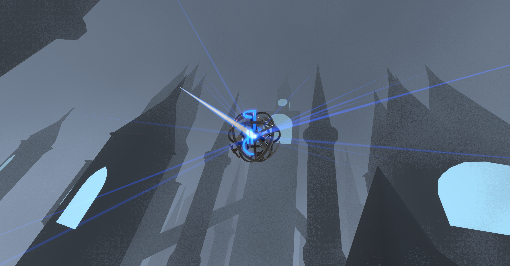

# Invested

Invested is a physics simulation and game made in the Unity engine. It is a personal interpretation and emulation of the physics of Allomancy, a magic system from the novel "Mistborn" by Brandon Sanderson.

Download the current build from [here.](https://www.dropbox.com/s/6o152qparaoede7/Invested.zip?dl=1)

Here are some short videos of the game:
- ["Centrifuge" Pulling](https://gfycat.com/BlackandwhiteEllipticalAfricanaugurbuzzard)
- [Pushing and Pulling on metal targets](https://gfycat.com/PowerfulPaleAuk)
- [Pull targets vs. Push targets](https://gfycat.com/FoolishUnderstatedBackswimmer)
- [Some recent developments to the HUD](https://gfycat.com/ChubbySelfishBoutu)

This Unity project makes use of:
	- [Volumetric Lines by Johannes Unterguggenberger](https://assetstore.unity.com/packages/tools/particles-effects/volumetric-lines-29160)
	- [Cakeslice's Outline Effect](https://github.com/cakeslice/Outline-Effect)
	- [The Heebo font](https://fonts.google.com/specimen/Heebo)

### Recent changes:

Version 1.1.5
- Implemented iron and steel reserves
	- Pushing/Pulling now consumes iron and steel
		- the mass of the iron/steel consumed is proportional to the force of the Push/Pull
		- passively burning iron/steel without Pushing/Pulling requires a slow burn of iron or steel to see the blue lines to metals
- Improved coin friction against large static objects

Version 1.1.4.1
- When coins are pushed into other objects, friction now more realistically holds the coin to the object until the coin is deflected away.
	- The push on the coin is transferred to the object.
	- The coin will rotate with the object, as long as it is held by friction.
- Smoothened the transitions for the blue lines to metals from in-focus to out-of-focus to off-screen

Version 1.1.4
- Improved blue metal lines
	- Reduced visual clutter by making lines dimmer when off-screen and brighter near the center of the the screen
	- Added option to change the color of the lines pointing to Push/Pull targets
- More intuitive Push/Pull target selection
	- Can "paint" while deselecting to deselect multiple targets, similar to how selecting works
	- Selecting a Push target for Pulling turns it into a Pull target, and vice-versa
	- Added option to disable the blue outline around the would-be-selected target near the center of the screen
- Magnitude Push Control Style now works with gamepad
	- Control target magnitude with up/down on the D-pad
	- Control number of targets with left/right on the D-pad (previously bound to up/down)
- Physics improvements
	- Coins
		- Coins are now thrown directly at crosshairs
		- When thrown at/pushed into non-static objects, friction holds the coin to the object (rather than the coin just bouncing away)
	- When pushing on multiple targets, you now push on the combined effective mass and Charge of all of them, rather than the mass of each individual target.
- Added Graphics settings (anti-aliasing, ambient occlusion, bloom, motion blur)
	- Changed fonts from Unity's default Arial to Heebo
- Added "Harmony Targets" to Luthadel, Sandbox, and Experimental scenes (WIP targets for the player to reach and complete a level)
